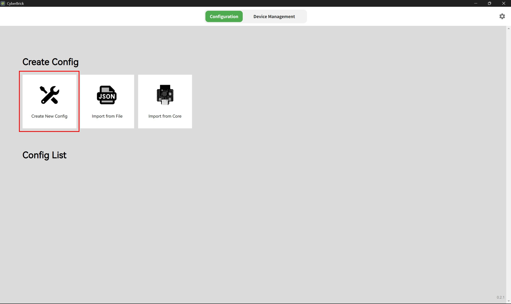
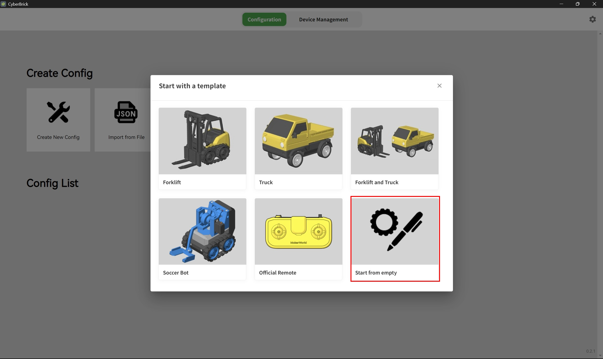
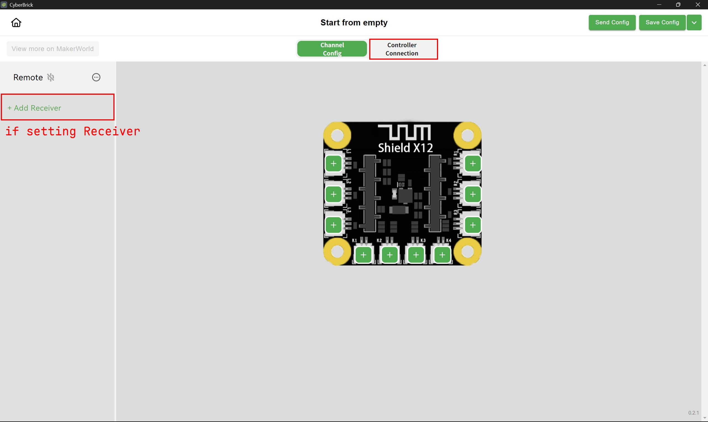
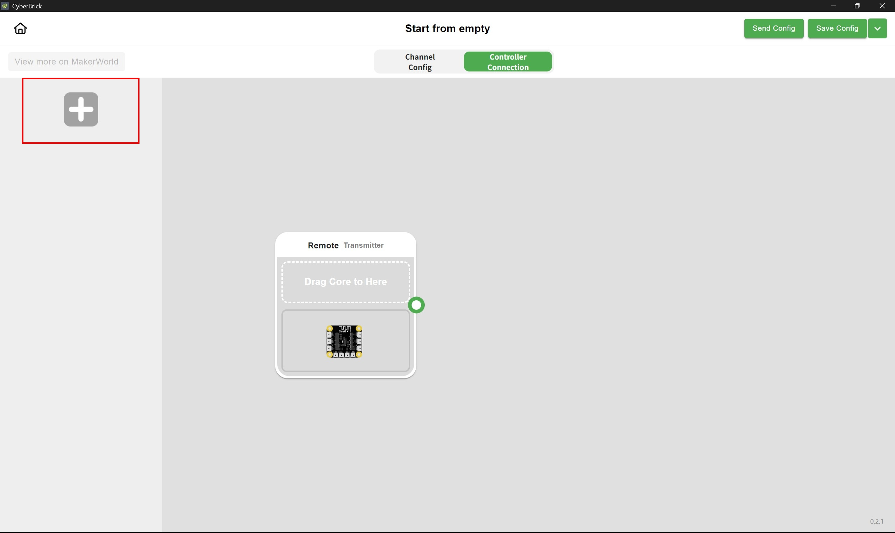
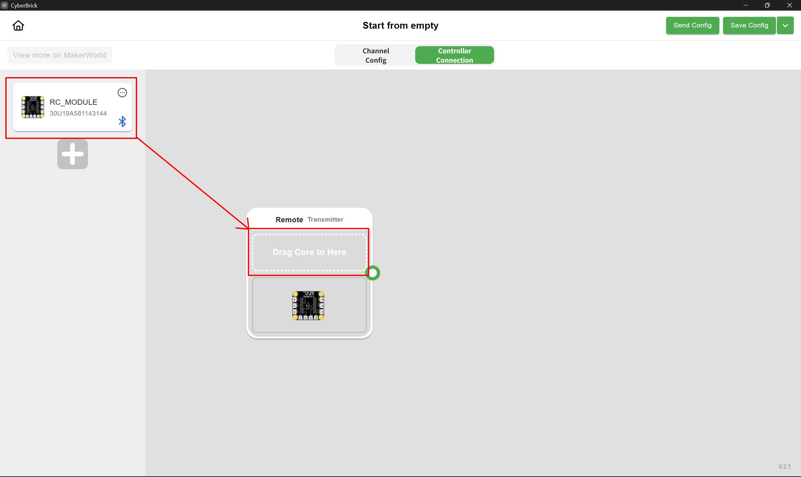
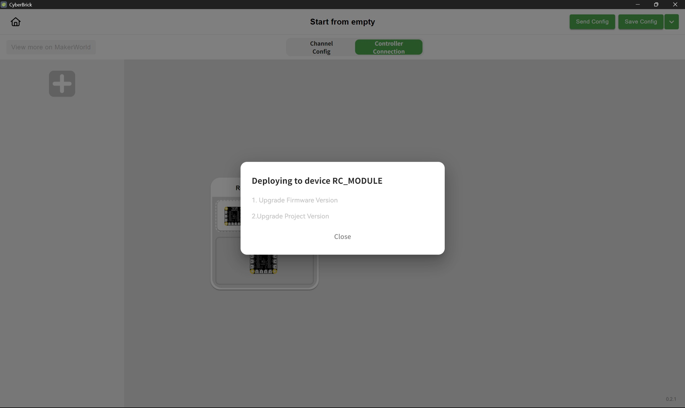

# CyberBrick SoccerBot

A remote-controlled soccer robot project built with [Singular Blockly](https://github.com/Shen-Ming-Hong/singular-blockly) visual programming extension for VS Code.

[繁體中文版本](README_zh-TW.md)

## 📋 Overview

This project contains two separate programs for building a remote-controlled soccer robot using CyberBrick:

| Folder               | Description               | Role                 |
| -------------------- | ------------------------- | -------------------- |
| `bot/`               | Soccer robot program      | Receiver (Slave)     |
| `remote_controller/` | Remote controller program | Transmitter (Master) |

### Program Screenshots

|                                Transmitter (Remote Controller)                                |                          Receiver (Robot)                           |
| :-------------------------------------------------------------------------------------------: | :-----------------------------------------------------------------: |
|  |  |

## 🔧 Hardware

For complete hardware information including:

- Bill of Materials (BOM)
- Assembly instructions
- Wiring diagrams

👉 Visit the official MakerWorld page: **[CyberBrick Official SoccerBot](https://makerworld.com/zh/models/1395987-cyberbrick-official-soccerbot#profileId-1446987)**

---

## 🚀 Getting Started

### Step 1: Install Singular Blockly Extension

1. Open VS Code
2. Go to Extensions view (`Ctrl+Shift+X`)
3. Search for **"Singular Blockly"**
4. Click **Install**

  

### Step 2: Wait for PlatformIO Installation

After installing Singular Blockly, you will be prompted to install **PlatformIO IDE** extension.

> ⚠️ **IMPORTANT:**
>
> - **Ensure stable internet connection** - PlatformIO needs to download necessary tools
> - **Do NOT interrupt the installation** - Wait patiently for PlatformIO to complete initialization
> - This may take several minutes on first install
> - If VS Code prompts you to restart, you can wait until all extensions are installed, then restart once

  

---

## 📂 Opening a Project

> ⚠️ **IMPORTANT:** The `bot/` and `remote_controller/` folders are **TWO SEPARATE PROJECTS**. You must open them individually in VS Code.

### Step 1: Open Project Folder

1. In VS Code, go to **File > Open Folder...**
2. Navigate to this repository
3. Select **either** `bot/` **or** `remote_controller/` folder
    - Choose `bot/` to work on the **robot** program
    - Choose `remote_controller/` to work on the **remote controller** program

> ⚠️ **Do NOT open the root folder** - You must open `bot/` or `remote_controller/` directly

  

> 📝 **Note:** The `.vscode` folder is auto-generated by VS Code. It's okay if you don't see it - this won't affect anything!

### Step 2: Open Blockly Editor

Click the **Singular Blockly icon** in the **Activity Bar** (left sidebar) to open the Blockly editor.

> 💡 **Tip:** The Activity Bar icon is larger and easier to click than the magic wand icon in the status bar.

  

### Step 3: View Your Program

The Blockly editor will automatically:

- Load the program from `blockly/main.json`
- Select the correct target board (CyberBrick)

  

You can now view and modify the block program!

---

## 📤 Uploading Programs

You need **two CyberBrick boards** - one for the robot and one for the remote controller.

### First-Time Setup for New CyberBrick Boards

> ⚠️ **IMPORTANT:** If you just received a new CyberBrick board, you must complete the following updates before using it:
>
> 1. **Upgrade Firmware Version** - Update to the latest firmware for optimal performance and compatibility
> 2. **Update Project Version** - Ensure the project files are synchronized with the current firmware

**Step 1:** Open CyberBrick Desktop

  

**Step 2:** Create a new empty project

  

**Step 3-5:** Connect to the CyberBrick core board (click "+ Add Receiver" if setting up receiver)

  

  

  

**Step 6:** Wait for firmware and project version update to complete

  

> 👉 For detailed instructions, visit: [CyberBrick Wiki](https://wiki.bambulab.com/en/cyberbrick)

> 💡 **Tip:** If you have already completed the first-time setup, you can skip this section and proceed directly to [Upload Steps](#upload-steps).

### Upload Steps

1. Connect CyberBrick to your computer via **USB-C cable**
2. Click the **Upload button** in the Blockly editor

  

3. Wait for upload to complete

|                              Uploading                              |                                Upload Success                                 |
| :-----------------------------------------------------------------: | :---------------------------------------------------------------------------: |
|  |  |

### Upload Both Programs

| Program                    | Open Folder          | Upload To     |
| -------------------------- | -------------------- | ------------- |
| Robot (Slave)              | `bot/`               | CyberBrick #1 |
| Remote Controller (Master) | `remote_controller/` | CyberBrick #2 |

---

## 🎮 Connection & Operation

### LED Status Indicators

| LED Color      | Status                                |
| -------------- | ------------------------------------- |
| 🟢 Cyan (Teal) | Connected successfully                |
| 🔴 Red         | Disconnected / Waiting for connection |

  

|                         Connection Paired Successfully                          |                 Unstable? Press Reset on Remote to Re-pair                  |
| :-----------------------------------------------------------------------------: | :-------------------------------------------------------------------------: |
|  |  |

### Connection Tips

- **Recommended power-on order:** Turn on the receiver (robot) first, then the transmitter (remote controller) for a more stable connection
- The **receiver (robot)** may take longer to establish connection
- If the robot shows red LED for too long, press the **Reset button** on the robot's CyberBrick board
- If the connection is unstable (LED keeps flashing cyan ↔ red), press the **Reset button** on the **remote controller** to resend the connection signal
- Connection timeout is set to **30 seconds**

---

## 🔗 Resources

- [Singular Blockly Extension](https://github.com/Shen-Ming-Hong/singular-blockly)
- [CyberBrick Official SoccerBot (MakerWorld)](https://makerworld.com/zh/models/1395987-cyberbrick-official-soccerbot#profileId-1446987)
- [CyberBrick Wiki](https://wiki.bambulab.com/en/cyberbrick)

---

## 📄 License

This project is licensed under the [MIT License](LICENSE).
