# CyberBrick 足球機器人

使用 [Singular Blockly](https://github.com/Shen-Ming-Hong/singular-blockly) VS Code 視覺化程式設計擴充套件製作的遙控足球機器人專案。

[English Version](README.md)

## 📋 概述

本專案包含兩個獨立程式，用於製作 CyberBrick 遙控足球機器人：

| 資料夾               | 說明           | 角色            |
| -------------------- | -------------- | --------------- |
| `bot/`               | 足球機器人程式 | 接收端 (Slave)  |
| `remote_controller/` | 遙控器程式     | 發送端 (Master) |

### 程式截圖

|                              發射端（遙控器）程式                              |                       接收端（機器人）程式                       |
| :----------------------------------------------------------------------------: | :--------------------------------------------------------------: |
| 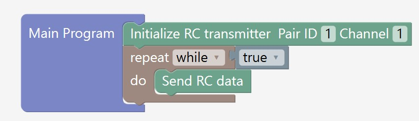 | 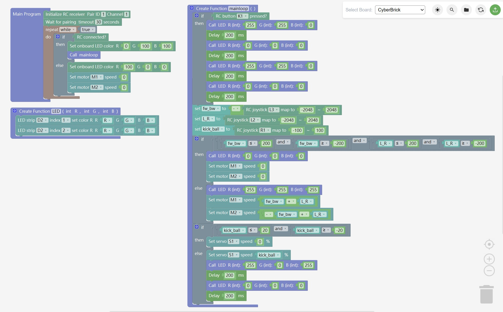 |

## 🔧 硬體

完整硬體資訊包含：

-   材料清單 (BOM)
-   組裝說明
-   接線圖

👉 請前往官方 MakerWorld 頁面：**[CyberBrick Official SoccerBot](https://makerworld.com/zh/models/1395987-cyberbrick-official-soccerbot#profileId-1446987)**

---

## 🚀 開始使用

### 步驟一：安裝 Singular Blockly 擴充套件

1. 開啟 VS Code
2. 開啟擴充套件檢視 (`Ctrl+Shift+X`)
3. 搜尋 **「Singular Blockly」**
4. 點擊 **Install** 安裝

  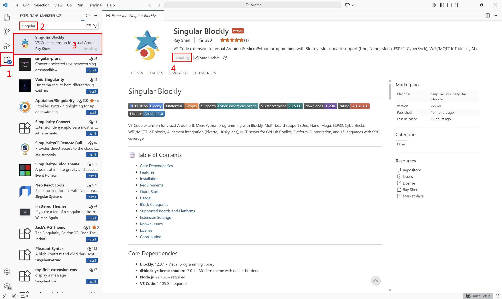

### 步驟二：等待 PlatformIO 安裝完成

安裝 Singular Blockly 後，系統會提示您安裝 **PlatformIO IDE** 擴充套件。

> ⚠️ **重要提醒：**
>
> -   **確保網路連線穩定** - PlatformIO 需要下載必要工具
> -   **請勿中斷安裝過程** - 請耐心等待 PlatformIO 完成初始化
> -   首次安裝可能需要數分鐘
> -   如果遇到 VS Code 重新啟動提示，可以等所有擴充套件都安裝完成後，再一次重新啟動即可

  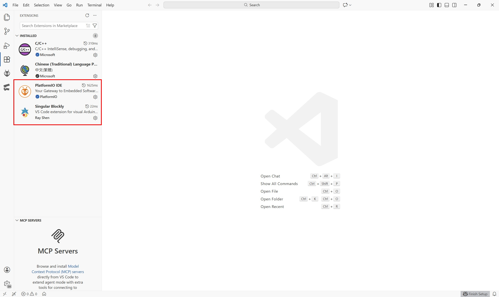

---

## 📂 開啟專案

> ⚠️ **重要提醒：** `bot/` 和 `remote_controller/` 資料夾是**兩個獨立專案**，必須分別在 VS Code 中開啟。

### 步驟一：開啟專案資料夾

1. 在 VS Code 中，選擇 **File > Open Folder...**
2. 瀏覽至本儲存庫
3. 選擇 `bot/` **或** `remote_controller/` 資料夾
    - 選擇 `bot/` 來編輯**機器人**程式
    - 選擇 `remote_controller/` 來編輯**遙控器**程式

> ⚠️ **請勿開啟根目錄** - 必須直接開啟 `bot/` 或 `remote_controller/`

  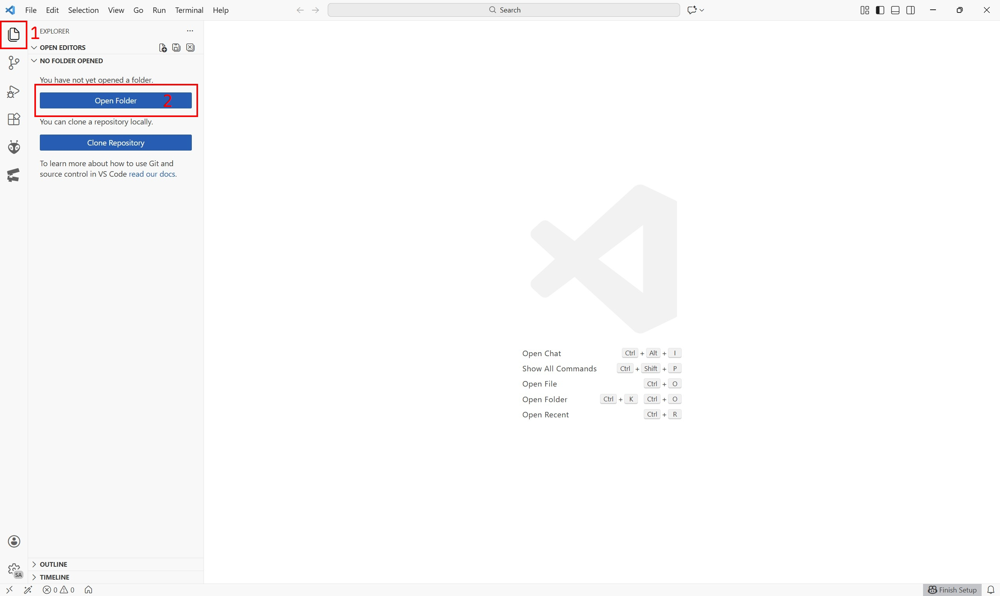

> 📝 **說明：** `.vscode` 資料夾是 VS Code 自動產生的，沒有看到也沒關係，不影響使用！

### 步驟二：開啟 Blockly 編輯器

點擊左側**活動列**中的 **Singular Blockly 圖示**來開啟 Blockly 編輯器。

> 💡 **提示：** 活動列圖示較大，比狀態列的魔杖圖示更容易點擊。

  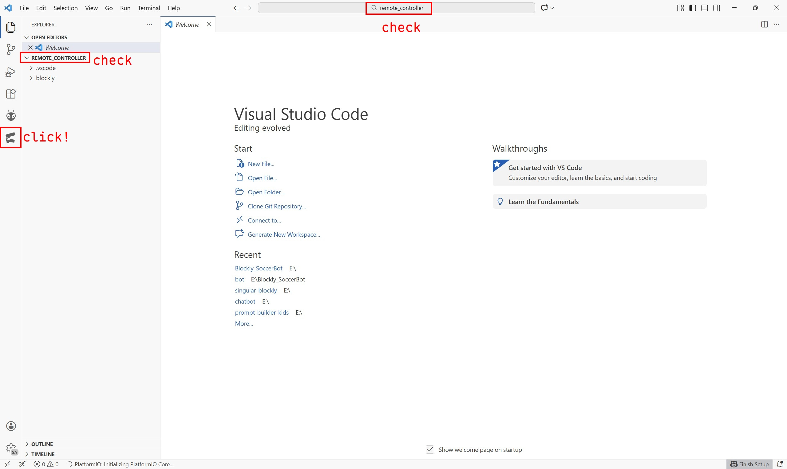

### 步驟三：檢視程式

Blockly 編輯器會自動：

-   載入 `blockly/main.json` 中的程式
-   選擇正確的目標板 (CyberBrick)

  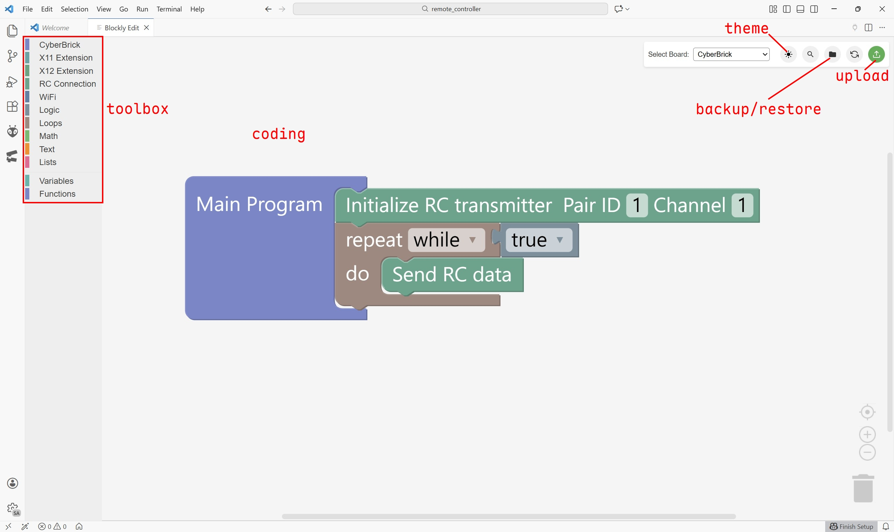

現在您可以檢視和修改積木程式了！

---

## 📤 上傳程式

您需要**兩塊 CyberBrick 開發板** - 一塊用於機器人，一塊用於遙控器。

### 上傳步驟

1. 使用 **USB-C 傳輸線**將 CyberBrick 連接到電腦
2. 在 Blockly 編輯器中點擊**上傳按鈕**

  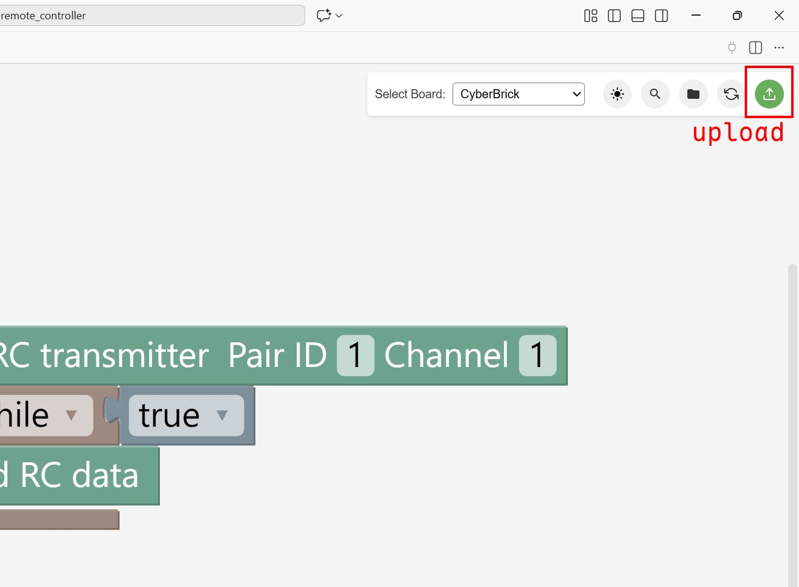

3. 等待上傳完成

|                               上傳中                                |                                   上傳成功                                    |
| :-----------------------------------------------------------------: | :---------------------------------------------------------------------------: |
| 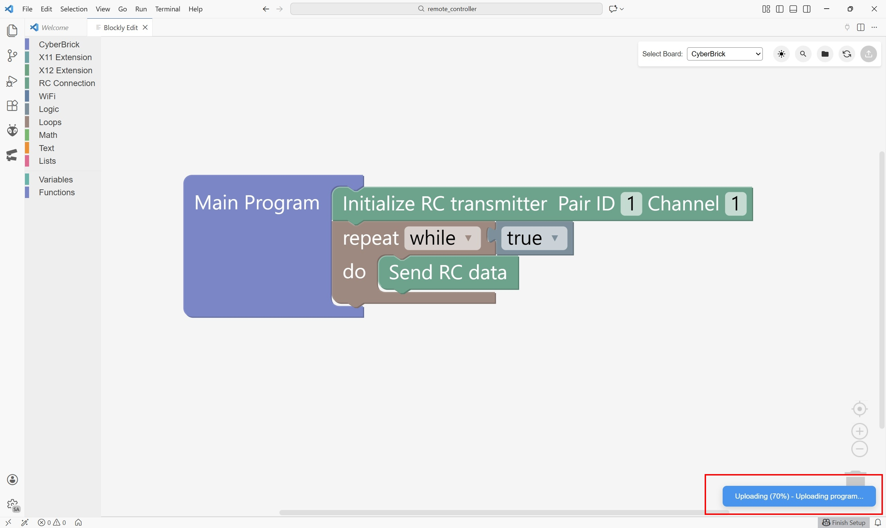 | 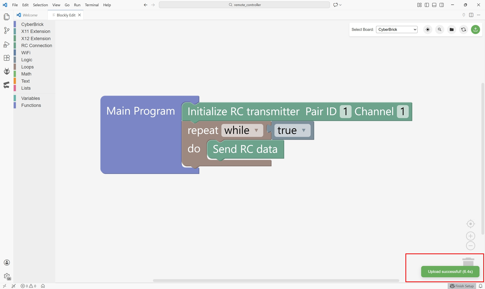 |

### 上傳兩個程式

| 程式            | 開啟資料夾           | 上傳至        |
| --------------- | -------------------- | ------------- |
| 機器人 (Slave)  | `bot/`               | CyberBrick #1 |
| 遙控器 (Master) | `remote_controller/` | CyberBrick #2 |

---

## 🎮 連線與操作

### LED 狀態指示

| LED 顏色 | 狀態            |
| -------- | --------------- |
| 🟢 青色  | 連線成功        |
| 🔴 紅色  | 斷線 / 等待連線 |

  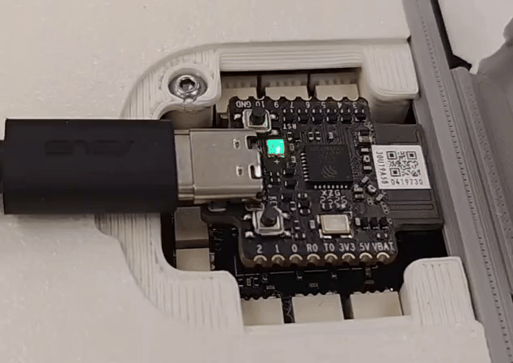

|                                  連線配對成功                                   |                    連線不穩定時，按遙控器 Reset 重新配對                    |
| :-----------------------------------------------------------------------------: | :-------------------------------------------------------------------------: |
|  |  |

### 連線提示

-   **建議開機順序：** 先開啟接收端（機器人），再開啟發送端（遙控器），連線會更穩定
-   **接收端（機器人）** 可能需要較長時間建立連線
-   如果機器人長時間顯示紅色 LED，請按下機器人 CyberBrick 板上的 **Reset 按鈕**
-   如果連線不穩定（LED 一直閃爍青色 ↔ 紅色），請按下**遙控器**的 **Reset 按鈕**來重新發送連線訊號
-   連線逾時設定為 **30 秒**

---

## 🔗 相關資源

-   [Singular Blockly 擴充套件](https://github.com/Shen-Ming-Hong/singular-blockly)
-   [CyberBrick 官方足球機器人 (MakerWorld)](https://makerworld.com/zh/models/1395987-cyberbrick-official-soccerbot#profileId-1446987)
-   [CyberBrick Wiki](https://wiki.bambulab.com/en/cyberbrick)

---

## 📄 授權

本專案採用 [MIT 授權條款](LICENSE)。
